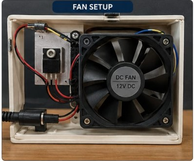

# Automatic Temperature-Based Fan Speed Control System

## Project Overview

The Automatic Temperature-Based Fan Speed Control System is an Arduino-based embedded-system project designed to automatically regulate the speed of a DC fan according to the surrounding temperature.

The temperature sensor continuously measures the ambient temperature and sends the reading to the Arduino UNO. The Arduino processes the temperature value and generates a PWM control signal for the fan. As the temperature increases, the fan speed is increased automatically, while lower temperatures result in reduced fan speed.

This project demonstrates practical applications of temperature sensing, microcontroller programming, PWM-based control and automation.

## Objectives

- Measure ambient temperature continuously.
- Automatically control DC fan speed according to temperature.
- Interface a temperature sensor with Arduino UNO.
- Implement automatic fan-speed control.
- Demonstrate PWM-based DC fan control.
- Develop a simple and low-cost temperature-regulation prototype.

## Components Used

| Component | Purpose |
|---|---|
| Arduino UNO | Main microcontroller and control unit |
| Temperature Sensor | Measures ambient temperature |
| DC Fan | Provides cooling |
| Fan Driver | Allows safe control of the fan |
| Power Supply | Provides power to the system |
| Breadboard/PCB | Circuit assembly |
| Connecting Wires | Electrical connections |

## Pin Configuration

| Component | Arduino UNO Pin | Function |
|---|---:|---|
| Temperature Sensor Output | A0 | Analog temperature input |
| Fan Driver Control | D9 | PWM output |

> Note: The above configuration represents the documented reference implementation. Exact historical pin assignments should be verified against the original project circuit if available.

## Hardware Connections

### Temperature Sensor

text
Temperature Sensor
       |
       +---- VCC → Arduino 5V
       +---- GND → Arduino GND
       +---- OUT → Arduino A0

Arduino D9
    ↓
Fan Driver
    ↓
DC Fan
    ↓
External Power Supply

---

# Step 11 — Working Principle

## Working Principle

1. The temperature sensor measures the surrounding temperature.
2. The sensor sends the measurement to the Arduino UNO.
3. The Arduino processes the temperature value.
4. The temperature is compared with predefined control ranges.
5. The Arduino generates an appropriate PWM signal.
6. The fan driver controls the DC fan according to the PWM signal.
7. As temperature increases, fan speed increases.
8. As temperature decreases, fan speed decreases.
9. The process continuously repeats.

| Temperature | Fan Response |
|---|---|
| Below 25°C | OFF / Minimum |
| 25–30°C | Low Speed |
| 30–35°C | Medium Speed |
| 35–40°C | High Speed |
| Above 40°C | Maximum Speed |

## How to Run

1. Open code/temperature_fan_control.ino in Arduino IDE.
2. Connect the temperature sensor output to A0.
3. Connect the fan-driver control input to D9.
4. Provide the appropriate power supply.
5. Select Arduino UNO in Arduino IDE.
6. Select the correct COM port.
7. Upload the program.
8. Open Serial Monitor at 9600 baud.
9. Change the temperature around the sensor.
10. Observe the corresponding change in fan speed.

## Testing

The prototype can be tested by gradually changing the temperature near the sensor and observing the corresponding fan-speed response.

### Expected Behavior

| Condition | Fan Response |
|---|---|
| Low temperature | Fan OFF / minimum |
| Moderate temperature | Low / medium speed |
| High temperature | High speed |
| Very high temperature | Maximum speed |
| Temperature decreases | Fan speed decreases |

## Results

The prototype demonstrates automatic temperature-dependent fan-speed regulation.

The Arduino continuously monitors temperature and adjusts the fan-control signal according to the programmed temperature range.

The project demonstrates:

- Temperature sensing
- Sensor interfacing
- Arduino-based processing
- PWM generation
- Automatic fan-speed regulation

## Applications

- Electronic equipment cooling
- Computer cooling systems
- Laboratory equipment cooling
- Small enclosure temperature management
- Automatic ventilation systems
- Embedded-system educational projects

## Limitations

- Temperature accuracy depends on sensor characteristics and calibration.
- Fan response depends on the fan and driver used.
- A single sensor measures temperature at only one location.
- The prototype is intended for educational demonstration.

## Future Scope

- LCD/OLED temperature display
- Multiple temperature sensors
- IoT-based monitoring
- Mobile notifications
- Temperature data logging
- More precise closed-loop control
- Automatic fault detection
- Improved thermal management

## Key Features

- Automatic temperature monitoring
- Automatic fan-speed regulation
- Arduino UNO-based control
- PWM fan control
- Continuous temperature feedback
- Low-cost embedded-system implementation

## Technologies Used

- Arduino UNO
- Embedded C/C++
- Arduino IDE
- Temperature sensing
- PWM
- Basic electronics and automation

## Learning Outcomes

Through this project, the following concepts were explored:

- Arduino programming
- Temperature sensor interfacing
- Analog signal measurement
- PWM generation
- DC fan control
- Embedded-system design
- Hardware integration
- Testing and troubleshooting

## Repository Structure

text
Automatic-Temperature-based-Fan-Speed-Control-System/
│
├── code/
│   └── temperature_fan_control.ino
│
├── diagrams/
│   ├── block_diagram.png
│   └── flowchart.png
│
├── images/
│   ├── project_front.jpg
│   ├── electronics.jpg
│   └── fan_setup.jpg
│
└── README.md

---

# Step 18 — Project Gallery

## Project Gallery

> The following visuals are illustrative representations of the project setup. They are not presented as original test photographs.

### Project Front View

### Electronics

### Fan Setup

## Author

**Gaurav Paste**

Electronics & Telecommunication Engineering
